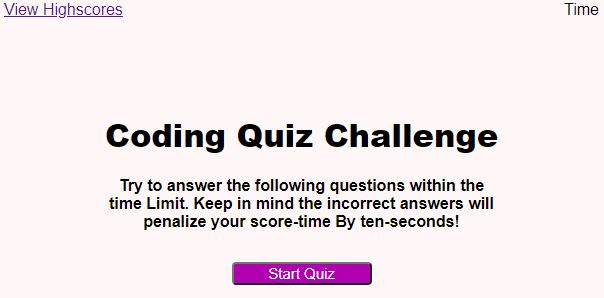
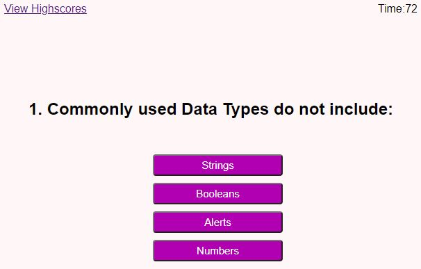
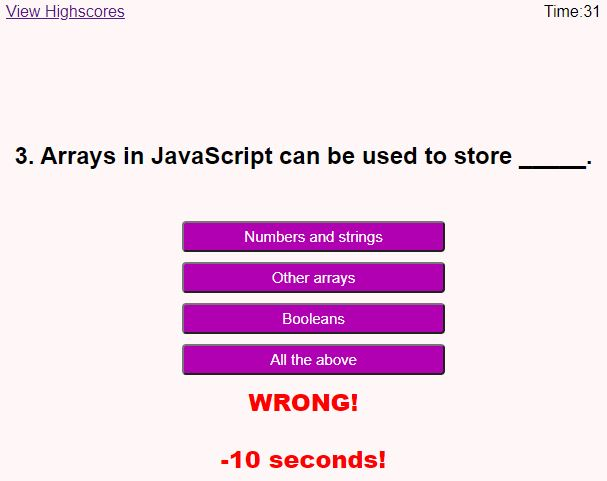
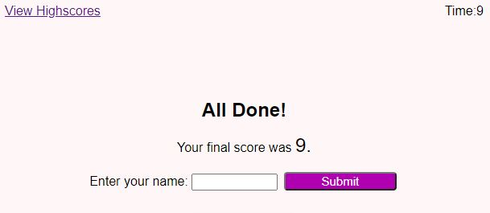
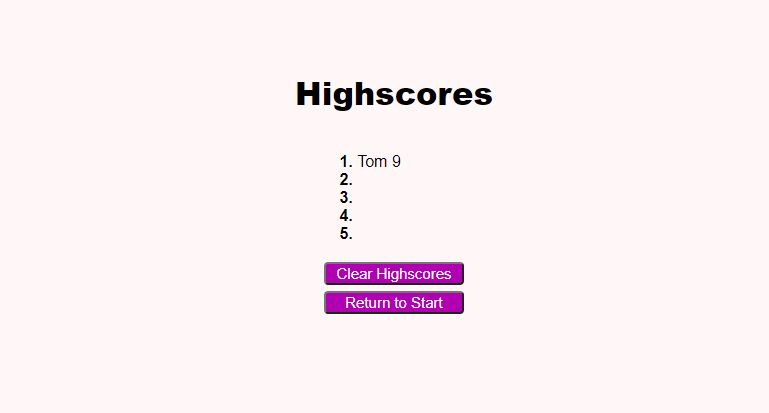

# Coding-quiz-challenge
A coding quiz powered by Javascript. 

A link to the live site: https://tmaxey201.github.io/Coding-quiz-challenge/

A link to my Github Repo: https://github.com/Tmaxey201?tab=repositories
 
 
## 1.)When I click the start button, a timer starts and I am presented with a question.
   

## 2.)Clicking the button with your answer choice will automatically go to the next question. 

## 3.)There is a 10 second reduction penalty when you get a question wrong.

## 4.)After you are finished with all the question, you are presented with a screen that shows your score. The score is your timer after you are finished.

## 5.)You can submit your name and it will take you to a highscore menu that will store your score. You can also reset the list and return to the start screen.

